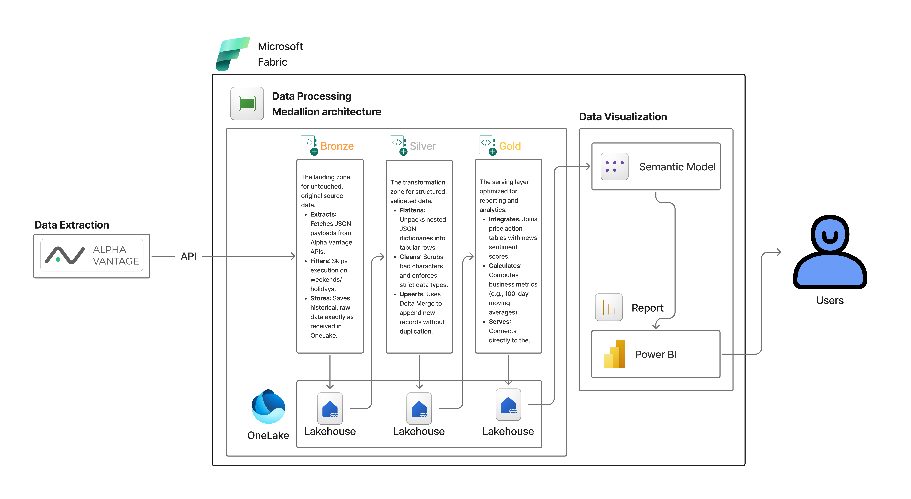
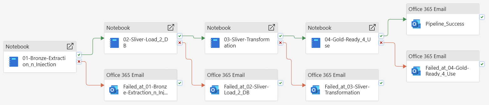
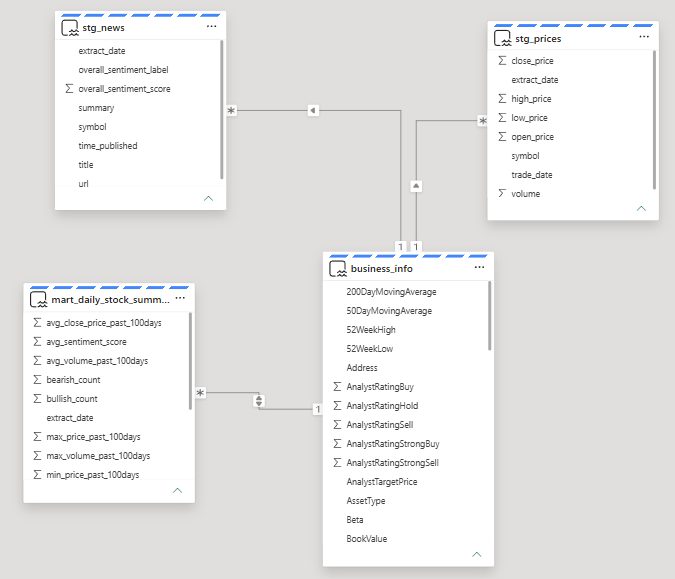
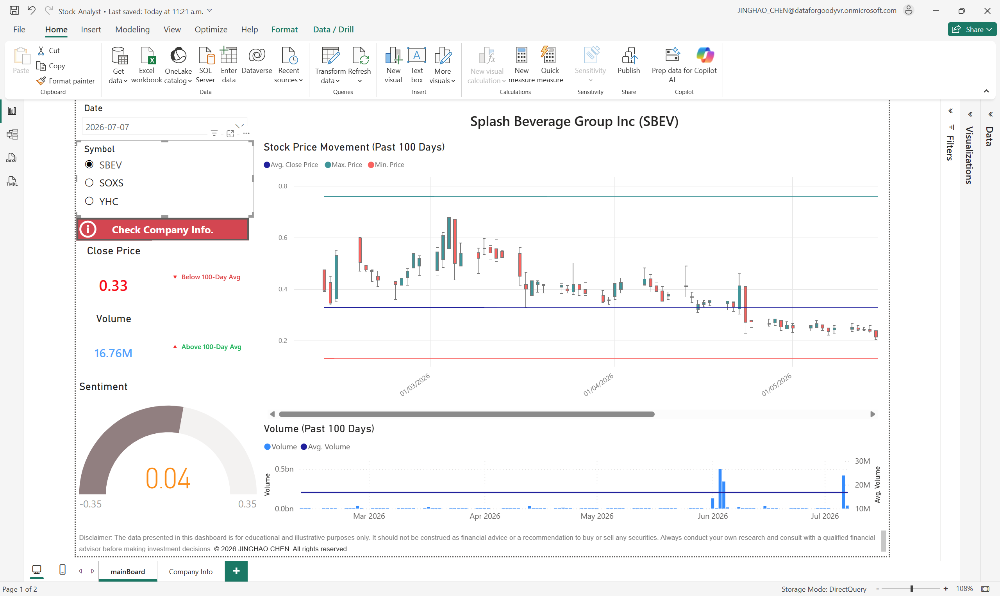
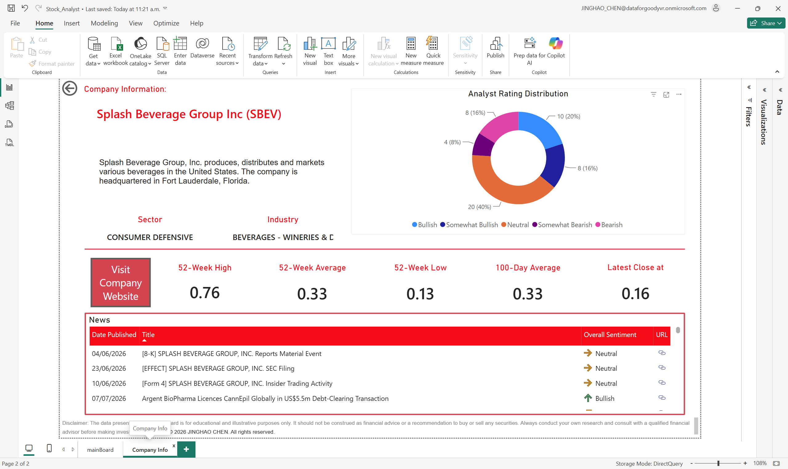

# 📈 Financial Market ELT Pipeline & Dashboard

[](https://github.com/syvixor/skills-icons)

**This repository is a modern recreation of my original ELT project.** It is an end-to-end automated data pipeline built entirely on Microsoft Fabric. This project orchestrates the daily extraction of stock market metrics, news sentiment, and business profiles, transforms the data using PySpark, and serves it through a highly dynamic Power BI dashboard.

- The original project can be found
  - Frontend repository: [de-project-2-Streamlit-4-Viz](https://github.com/chenjinghao/de-project-2-Streamlit-4-Viz)
  - Backend repository: [de-project-1-airflow-dbt-4-ELT](https://github.com/chenjinghao/de-project-1-airflow-dbt-4-ELT)

- Live Streamlit dashboard: [JINGHAOdata.engineer](https://www.jinghaodata.engineer/)
- Tableau Public dashboard: [Tickers Analysis Dashboard](https://public.tableau.com/views/TickersAnalysisDashboard/Dashboard?:language=en-US&:sid=&:redirect=auth&:display_count=n&:origin=viz_share_link)
---

## 🏗️ Architecture & Pipeline Design


*High-level system architecture showcasing the flow from Alpha Vantage APIs through the OneLake Medallion architecture into Power BI.*

This project follows a strict **Medallion Architecture** to ensure data quality, scalability, and performance. 

* **🥉 Bronze Layer (Raw Ingestion):** * Extracts the top 3 most actively traded stocks daily using the Alpha Vantage API.
  * Fetches corresponding daily time-series prices, news sentiment, and company overview data.
  * Checks market calendars (`pandas_market_calendars`) to gracefully skip execution on weekends and market holidays.
  * Data is stored in OneLake as raw JSON files partitioned by extraction date.
* **🥈 Silver Layer (Cleansing & Structuring):** * PySpark notebooks flatten heavily nested API responses (e.g., exploding dictionary maps into tabular rows).
  * Implements "Schema on Write" to scrub dirty data (e.g., converting malformed API hyphens into nulls) and enforce strict data types.
  * Uses **Delta Merge** operations to upsert historical prices and perform fast appends for new daily batches without duplicating records.
* **🥇 Gold Layer (Business Aggregation):** * Joins daily price action with bullish/bearish news sentiment scores.
  * Aggregates 100-day moving averages, volume metrics, and sentiment trends.
  * Materialized as business-ready Delta Parquet tables for direct reporting.

## ⚙️ Orchestration & Alerting



The entire ELT process is automated using a **Microsoft Fabric Data Factory Pipeline**. 
* **Sequential Execution:** Notebooks run in a strict dependency chain from Bronze extraction to Gold aggregation.
* **Automated Alerting:** Integrated with Office 365 Outlook to send customized email notifications upon total pipeline success, or to trigger targeted failure alerts identifying the exact notebook that broke.

## 🗄️ Semantic Model



The reporting layer connects directly to the Lakehouse SQL Analytics Endpoint. The semantic model establishes relationships between the fact tables (`stg_prices`, `stg_news`, `mart_daily_stock_summary`) and the dimension table (`business_info`), utilizing a clean schema optimized for DAX performance.

## 📈 Dashboard Features

The reporting layer is designed for modularity and immediate financial insight, utilizing advanced DAX to create a reactive user experience.

### Main Market Board

* **Custom KPI Modules:** Engineered DAX measures dynamically track the latest close price and daily volume against 100-day moving averages, triggering custom text indicators (🔺 Above 100-Day Avg / 🔻 Below 100-Day Avg) and conditional formatting.
* **Trend Visualization:** Utilizes the OKViz Candlestick chart with a continuous x-axis to map 100 days of price action against average baselines, alongside a dynamic Sentiment Gauge.

### Company Profile Page

* **Dynamic Profiling:** Dashboard titles, sector/industry subtitles, and full business descriptions automatically update based on the selected ticker symbol.
* **Web Integration:** Formatted data categories natively convert raw URL text into clickable web icons for seamless navigation to company SEC filings and news sources.

## 🛠️ Tech Stack

* **Environment/Platform:** Microsoft Fabric (Lakehouse, SQL Analytics Endpoint, Data Factory Pipelines)
* **Data Processing:** PySpark (Synapse Spark Pools)
* **Storage Framework:** Delta Lake / OneLake
* **Visualization:** Power BI (Direct connection to Lakehouse SQL endpoint)
* **Languages:** Python, SQL, DAX

## 🚀 Setup & Execution

1. **Clone the repository:**
   ```bash
   git clone [https://github.com/yourusername/most-active-stocks-pipeline.git](https://github.com/yourusername/most-active-stocks-pipeline.git)
   cd most-active-stocks-pipeline